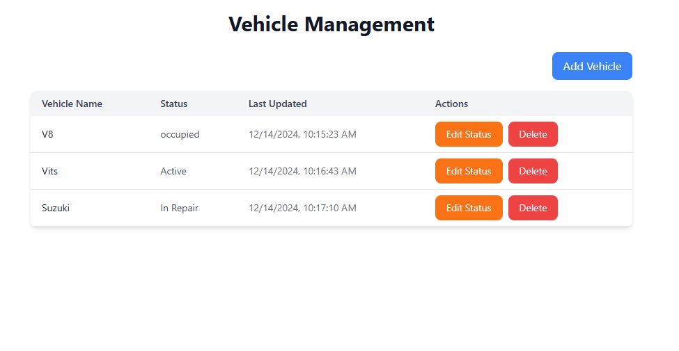

# Vehicle Management

## Overview

This project is a **Vehicle Management Dashboard** built with **React.js** for the frontend and **Node.js** with **MongoDB** for the backend. It allows users to manage vehicle data, including adding new vehicles, updating their statuses, and displaying all vehicle details in a table.

## Features

- Add a new vehicle
- Update vehicle status
- View all vehicles
- Responsive design with modern UI

## Technologies Used

- **Frontend:**
  - React.js
  - Tailwind CSS
  - Axios (for API requests)

- **Backend:**
  - Node.js
  - Express.js
  - MongoDB

## Installation

To run this project locally, follow the steps below:

1. Clone the repository:

```bash
git clone https://github.com/Esam-jr/Vehicle_managment.git
